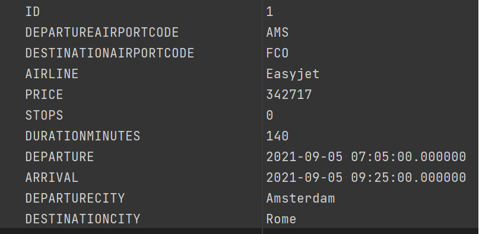
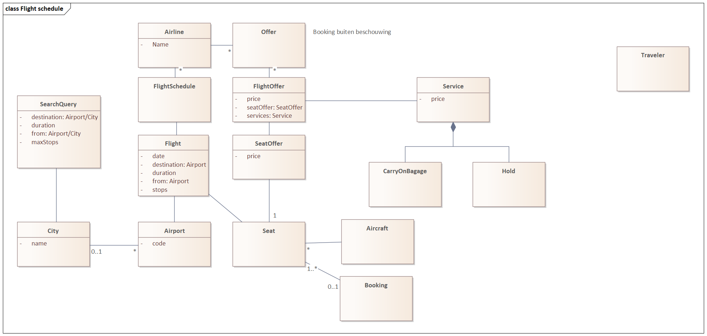

# Booking coding challenge

## Project
### Description
- Based on the dropwizard example (standard dropwizard setup)
- Uses H2 in memory database
- Project uses just one domain object `FlightSchedule` found at /flightschedule
- Demonstrates the REST API and search implementation

### Requirements
- jre/jdk-11

### Setup
No setup required

## HTTP endpoints
TODO add API doc (swagger?)
- ```/flightschedule```
    - POST; Create a new `flightschedule`
    - GET; Returns all `flightschedules`
- ```/flightschedule/search```
    - GET; Searches `flightschedules` Returns found `flightschedules`

### Run
There is a /dist directory which contains all the files
Just use the run.cmd or run.sh in the dist directory
Or use: `java -jar dist\booking-coding-challenge-1.0.0-SNAPSHOT.jar server booking.yml`<br/>
Should now be running on `https://localhost:8943` (SSH) <br/>
Alternatively use dockerfile to run as docker container
`source docker_build_run.sh` or `docker_build_run.cmd`

### Test
Use junit / IT test or
can be tested with Postman, import the `"Booking coding challenge.postman_collection.json"`
Data in DB:<br/>


#### Used ports
Non default ports to prevent conflicts
* 8680 HTTP  (main application port)
* 8943 HTTPS (main application port)
* 8082 HTTP  (admin connector)
* 8445 HTTPS (admin connector)

### Disclaimer
a lot of things have been omitted and even what I have built is just PoC / WIP.

### Domain model sample
Basic sample domain model:<br/>


### Troubleshooting

#### Database
Database can be cleared with:</br>
`java -jar dist\booking-coding-challenge-1.0.0-SNAPSHOT.jar db drop-all booking.yml --confirm-delete-everything`</br>
Recreated with:</br>
Init h2 DB:</br>
`java -jar dist\booking-coding-challenge-1.0.0-SNAPSHOT.jar db migrate booking.yml`</br>


#### Java 11
Wrong java version then add the full path to Java</br>
For example on Windows: `"C:\Program Files\Java\jdk-11.0.1\bin\java.exe" -jar booking-coding-challenge-1.0.0-SNAPSHOT.jar server booking.yml`</br>


### Maven plugin problem
For dev work: add `-Dmdep.analyze.skip=true` if this maven plugin gives trouble</br>
`mvn compile -Dmdep.analyze.skip=true -f pom.xml`</br>
